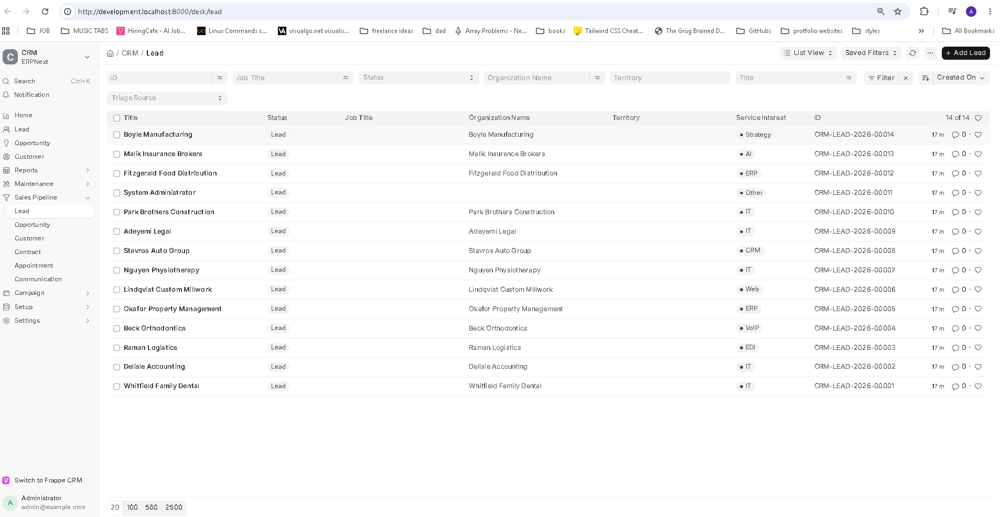
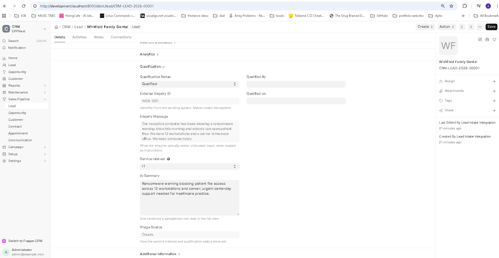
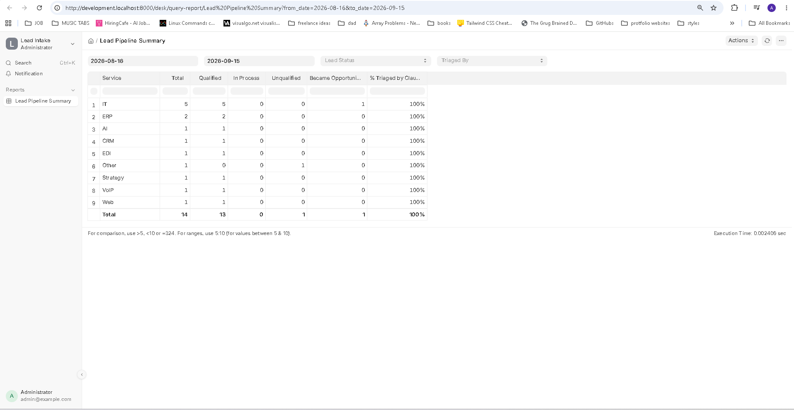

# lead_intake

A Frappe app for ERPNext v16. A website enquiry arrives by webhook and becomes a CRM **Lead**; a background job then has Claude fill in which service the enquirer wants, whether they look worth pursuing, and a one-line summary. If Claude is unavailable — or answers with anything outside the allowed values — keyword rules do the job instead, and the Lead records which of the two decided.

Built with [Claude Code](https://claude.com/claude-code). See [Who did what](#who-did-what).

---

## What it looks like

**Leads after triage.** Service and summary are filled in before anyone opens the record.



**One Lead.** `Triage Source` says who filled the fields in, so an AI's guess is never mistaken for a person's decision.



**Lead Pipeline Summary.** What came in, what it was about, and how much of it the model actually touched.



---

## How the pieces connect

```
website backend
   │  POST /api/method/lead_intake.api.intake_enquiry
   │  Authorization: token <api_key>:<api_secret>
   ▼
api.py ──── validates, rejects duplicates ────► ERPNext Lead
   │                                              │
   │  responds immediately                        │ after_insert
   ▼                                              ▼
{"lead": "CRM-LEAD-2026-00001",           redis queue ──► worker
 "duplicate": false}                                        │
                                                            ▼
                                                        triage.py
                                                     ┌──────┴──────┐
                                              Claude API      rules.py
                                          (enum-constrained)   (keywords)
                                                     └──────┬──────┘
                                                            ▼
                                        service_interest, qualification_status,
                                        ai_summary, triage_source
                                                            │
                                                            ▼
                                              Lead Pipeline Summary (SQL)
```

The webhook never waits on the model. It validates, writes the Lead, and replies; the classification happens in a background worker a second later.

---

## Decisions worth explaining

| Decision | Why |
|---|---|
| **Idempotency is enforced by a unique index, not a lookup** | A lookup alone loses the race when a sender retries twice at once. The lookup handles the ordinary case; a `UniqueValidationError` catch handles the collision |
| **Claude's answer is constrained *and* re-validated** | The request carries a JSON schema whose enums are the allowed values. The response is then checked against those same lists before anything is written. Out of range means the rules run instead |
| **Enquiry text is data, never instructions** | It arrives inside `<enquiry>` delimiters, and the system prompt says any instruction found inside is to be classified rather than obeyed. Sample enquiry #12 is a live attempt at exactly that |
| **The rules path has no model and no network** | So "the API is down" is a slower classification, not an outage. It is also what runs when no API key is configured |
| **Triage never overwrites a human** | It fills only what is still untouched, and records `Triage Source` so the difference is visible afterwards |
| **The integration user can create and read Leads, nothing else** | A token that leaks from a website's backend cannot reach customers, invoices or accounts |
| **Custom fields are declared in code** | `after_install` and `after_migrate` recreate them, so a fresh install reproduces the app rather than depending on someone clicking the right things |
| **SQL is parameterised** | Filters are bound values; nothing from a user is formatted into the query string |

---

## Running it locally

Requires ERPNext v16 on a Frappe bench (Frappe v16 needs Python 3.14 and Node 24).

```bash
bench get-app https://github.com/ajamores/erpnext-lead-intake.git
bench --site <site> install-app lead_intake
```

Installing creates the custom fields on Lead. Then create the integration user, and note the token it prints once:

```bash
bench --site <site> execute lead_intake.setup.integration_user.create_integration_user
```

Claude triage is optional. Without a key, the rules path runs. To enable it, add to the site's `site_config.json`:

```json
{
  "anthropic_api_key": "sk-ant-...",
  "lead_intake_claude_model": "claude-haiku-4-5"
}
```

Send the sample enquiries:

```bash
export INTAKE_URL=http://<site>:8000
export INTAKE_TOKEN=<api_key>:<api_secret>
python scripts/send_sample_enquiries.py
```

Fifteen enquiries, of which one repeats an earlier enquiry ID and one is a prompt-injection attempt. Expect `14 created, 1 duplicate, 0 failed`.

Run the tests — Claude is mocked, so no key is needed and no API calls are made:

```bash
bench --site <site> set-config allow_tests true
bench --site <site> run-tests --app lead_intake
```

---

## The API

`POST /api/method/lead_intake.api.intake_enquiry`

```json
{
  "external_enquiry_id": "WEB-1001",
  "contact_name": "Dana Whitfield",
  "company_name": "Whitfield Family Dental",
  "email": "dana@whitfielddental.example",
  "phone": "905-555-0134",
  "message": "Our reception computer has been showing a ransomware warning..."
}
```

Required: `external_enquiry_id`, `contact_name`, `email`, `message`.

| Response | Meaning |
|---|---|
| `200 {"lead": "CRM-LEAD-2026-00001", "duplicate": false}` | Created |
| `200 {"lead": "CRM-LEAD-2026-00001", "duplicate": true}` | That enquiry ID already exists; nothing was created |
| `400 {"error": "Missing required field(s): email"}` | Bad input, with the problem named |
| `409 {"error": "A Lead already exists for x@y.example: CRM-LEAD-…"}` | ERPNext enforces one Lead per email address |
| `403` | Missing or invalid credentials |

---

## Known limitations

- **A returning enquirer gets a 409.** ERPNext's Lead enforces a unique email address, so a second enquiry from the same person is refused rather than attached to the existing Lead. Recording it against that Lead as a note is the obvious next step.
- **The keyword fallback is literal.** It matches words, so an enquiry that merely mentions "ERP" is classified as ERP. It cannot be talked into qualifying something it shouldn't, but it has no understanding of context — that is the price of a path that cannot fail.
- **No public form.** The token belongs on a server, never in a browser, so the sample script stands in for a website's backend.
- **One model call per Lead.** No batching, and no retry beyond the SDK's own.

---

## Who did what

**Armand Amores** chose the problem and the scope, set up ERPNext and the container stack, ran the bench and site installation, created the first custom field through Customize Form, configured the site, and tested the endpoint and the triage by hand. `docs/FRAPPE-NOTES.md` is his own record of learning Frappe while building this — his wording, corrected but not rewritten.

**Claude Code** wrote the Python, the tests, the report and this README, working from his spec and his decisions.

`docs/BUILD-LOG.md` records who did what step by step, including the bugs hit and how they were fixed. Commits carrying a `Co-Authored-By: Claude` trailer are Claude-written; the others are Armand's own work.

This was Armand's first Frappe app, built in a single evening.
